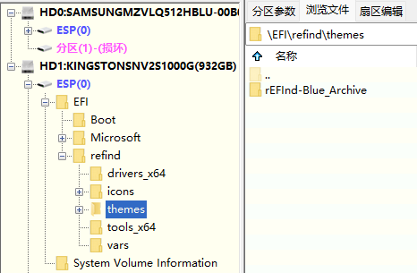
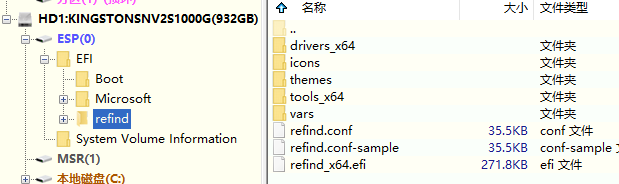

# rEFInd-Blue_Archive --> rEFInd-碧蓝档案

这是本作者制作的碧蓝档案的rEFInd的引导主题

## 安装

1.解压`rEFInd-Blue_Archive.zip`

2.然后将`rEFInd-Blue_Archive`文件夹复制到`EFI`->`rEFInd文件夹`(这里是你自己的名字)->`themes文件夹`

3.将`refind.conf`复制到你自己命名的refind文件夹里

安装图

